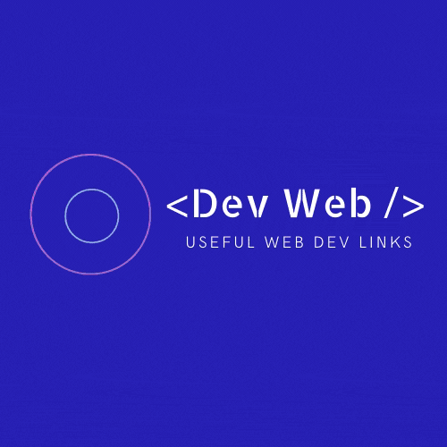

# Dev Web

Our goal is to create a useful portal for developers to find news, job postings, industry podcasts and relevant information all in one spot. Stop scouring all over the web just to find and manage your web dev bookmarks. 

Link to our deployed app: [DevWeb](https://dev-web3.herokuapp.com/)

## Team Members

* [Annie Kwan](https://github.com/akwanmtl)
* [Elshie Akindele](https://github.com/elshie21)
* [Hector Garcia Millares](https://github.com/hector-gm)
* [Jhonny Lin](https://github.com/Jlin72)
* [Kevin Sajan](https://github.com/kevsaj)
* [Niv Suroghon](https://github.com/nsuroghon)

## Branding

## Project Description

Similar to how the Chrome extension <b>Daily Dev</b> provides a mosaic of dev-geared article links, we're looking to build and provide a web dev portal to access industry news, job postings, dev podcasts and relevant links to save users time.

We're adding database functionality to our solution to ease the load of bookmarking/favouriting useful reference links and reading list from the browser.

## User Stories
- As a developer, I want links to relevant information so that I can keep up-to-date with the industry.
- As a busy individual, I want to find these links in one app so that I can find podcasts, news, job listings and information in one place.
- As a sometimes-forgetful-person, I want the option to bookmark and save links so that I can use them for frequent reference and to find my to-read list easily.

## App Sample

## APIs Used

1. [Listen Notes](https://www.listennotes.com/api/docs)
2. [Hacker News](https://github.com/HackerNews/API)
3. [News API](https://newsapi.org/docs)
4. [GitHub Jobs](https://jobs.github.com/api)
5. [Codewars](https://dev.codewars.com/)
6. [Random User](https://randomuser.me/)

## Libraries Used

* [Axios](https://www.npmjs.com/package/axios)
* [bcrypt](https://www.npmjs.com/package/bcrypt)
* [Font Awesome](https://fontawesome.com/)
* [Mongoose](https://mongoosejs.com/)
* [OAuth 2.0](https://oauth.net/2/)
* [Passport](http://www.passportjs.org/)
* [Popper](https://popper.js.org/)
* [Puppeteer](https://www.npmjs.com/package/puppeteer)
* [React-Font](https://www.npmjs.com/package/react-font)
* [React-Image-Fallback](https://www.npmjs.com/package/react-image-fallback)
* [React-Outside-Click-Handler](https://www.npmjs.com/package/react-outside-click-handler)
* [Tailwinds CSS](https://tailwindcss.com/)

## Tech Used

* [MongoDB](https://www.mongodb.com/) + [MongoDB Atlas](https://www.mongodb.com/cloud/atlas)
* [Express](https://expressjs.com/)
* [React](https://reactjs.org/)
* [Node](https://nodejs.org/en/)

## Credits

Our app is deployed and hosted in [Heroku](https://www.heroku.com). 
It gathers content from [CodeWars](https://www.codewars.com/), [ListenNotes](https://www.listennotes.com/), [Hacker News](https://news.ycombinator.com/), [GitHub Jobs](https://jobs.github.com/), and [News API](https://newsapi.org/).

Icons are sourced via [Devicon](https://devicon.dev/).

Third-party account authentication is possible via [GitHub](https://github.com/) and [Google](https://www.google.com/account/about/) using [OAuth 2.0](https://oauth.net/2/). 

Our logo was put together using [Canva](https://www.canva.com/).

## Future Development

As part of our goal to provide useful links to developers, we intend to draw from more news sources, industry job boards and podcast/music content providers to further curate our app's offerings and, thus, increase its usefulness to our users.

Future features may include a community reference and support board for developers to reach out to others to brainstorm and find elegant and efficient solutions to coding problems.

## License

Licensed under the [MIT](https://choosealicense.com/licenses/mit/) license.

## Contributing

Pull requests are welcome. For any changes, please open an issue first to discuss what you would like to change.

